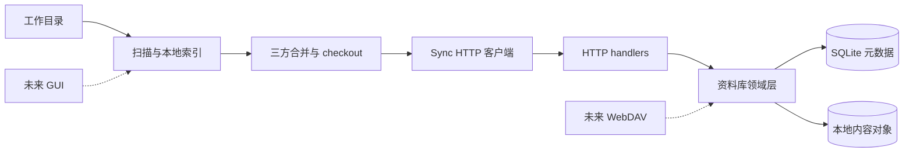
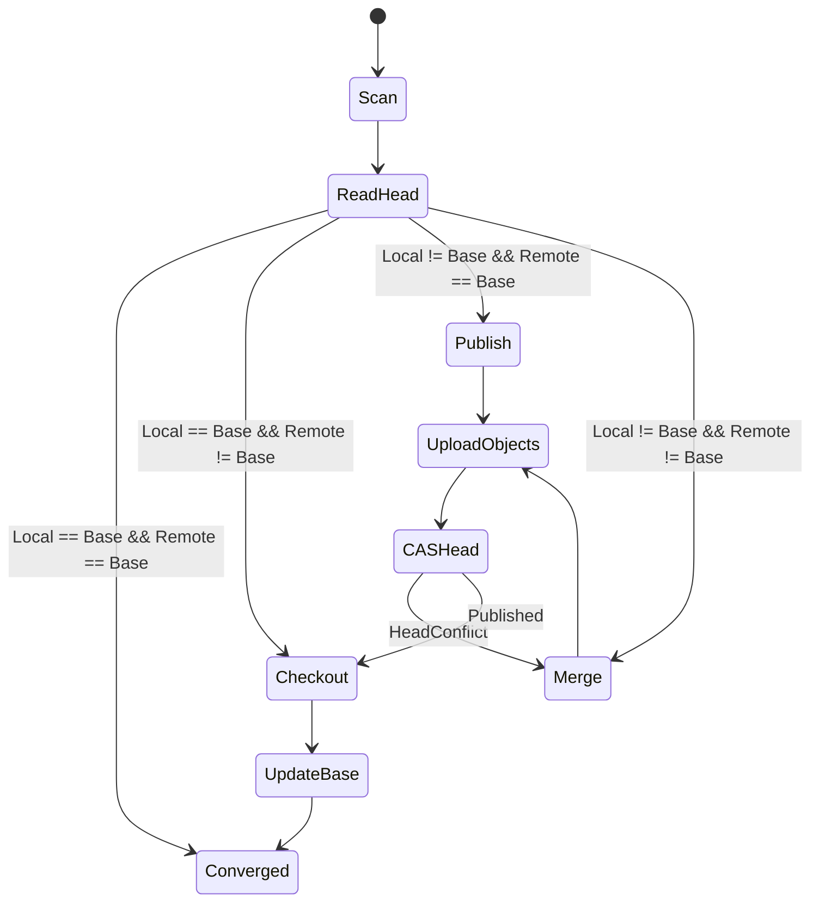

# Filecloud 同步设计

状态：阶段 0 评审中。

本文定义第一阶段的领域模型、持久化不变量、同步状态机、冲突语义和部署边界。HTTP 细节见 [HTTP API 契约](./http-api.md)，实施顺序见 [第一阶段计划](./phase-1-plan.md)。标记为不变量的承诺必须先通过状态机模型测试和 ext4/APFS/NTFS 文件系统 spike，才能转为冻结基线。

## 目标与边界

第一阶段是单节点 Go 服务端和跨平台 Go CLI。一个用户拥有多个资料库，一个资料库可在多个设备上绑定一个工作目录。服务端保存完整不可变历史；客户端通过扫描、对象传输和 Head CAS 收敛。

不兼容 Seafile。WebDAV、GUI、移动端和虚拟盘未来都只能作为同一资料库领域层之上的独立适配层。

## 系统结构



外部模块保持少而深：同步器提供“一轮收敛”，资料库领域层提供“读取 Head、接收已校验对象、原子发布 Commit”。路由、SQL 和文件路径不进入合并算法。

## 不变量

1. 内容对象不可修改；相同 ID 必须对应相同字节。
2. 服务端必须重算上传内容的 SHA-256，不能信任客户端声明。
3. Head 只能通过带 Expected Head 的原子 CAS 改变。
4. 新 Head 发布前，其 Commit、目录、文件和 blocks 必须全部存在且通过结构校验。
5. 未发布对象不能影响当前资料库读取结果。
6. checkout 不直接覆盖目标文件；必须临时写、校验、同步落盘后原子替换。
7. 同步完成时，工作目录快照、客户端 Sync Base 和服务端 Head 必须一致。
8. 冲突和错误不得静默丢弃任一已确认内容。
9. 客户端不得把可观察到的不完整扫描或并发变化发布为删除或混合版本。普通文件系统不能为不配合的写入进程提供绝对快照；第一阶段的强保证边界见“扫描”。
10. Head CAS 前必须持久化待发布记录；响应丢失或进程崩溃后必须能区分“尚未发布”“已发布待 checkout”和“已被后继提交包含”。
11. 鉴权先于资源存在性检查。

## 内容对象

ObjectId 是对象规范字节的 SHA-256，以 64 位小写十六进制表示。元数据对象使用 [RFC 8785 JCS](https://www.rfc-editor.org/info/rfc8785) 生成 UTF-8 规范 JSON；只允许 I-JSON，不允许重复键、浮点数或未知必填版本。

所有对象都带 `Version: 1` 和 `Type`。时间固定为 UTC、整秒、无小数的 `YYYY-MM-DDTHH:MM:SSZ`；大小等整数固定为无符号十进制字符串，除 `"0"` 外不得有前导零。这样避免字符串语义等价但 ObjectId 不同。

### Block

Block 是最多 4 MiB 的原始字节。普通文件从偏移 0 依次固定切分，最后一块可更小，空文件没有 block。

```text
BlockId = SHA-256(raw bytes)
```

### File

```json
{
  "Blocks": ["<BlockId>"],
  "Size": "4194304",
  "Type": "File",
  "Version": 1
}
```

`Blocks` 顺序有意义。`Size` 必须等于所有 block 实际大小之和；空文件的数组为空。

### Directory

```json
{
  "Entries": [
    {
      "Id": "<ObjectId>",
      "ModifiedAt": "2026-08-09T00:00:00Z",
      "Name": "report.txt",
      "Type": "File"
    }
  ],
  "Type": "Directory",
  "Version": 1
}
```

Entries 必须按 NFC 规范化后 `Name` 的 UTF-8 字节升序，名称只能是单个路径段，同目录不得存在 Unicode 或大小写折叠碰撞。路径状态是 `(Type, Id, ModifiedAt)`；`ModifiedAt` 精确到整秒并参与 Directory ObjectId。客户端索引同时保存协议规范值和实际落盘值，内容未变时不得因文件系统截断时间精度而产生新对象。目录对象不保存可由子对象推导的递归大小。

### Commit

```json
{
  "AuthorUserId": "<UUID>",
  "CreatedAt": "2026-08-09T00:00:00Z",
  "DeviceId": "<UUID>",
  "Message": "sync",
  "Parents": ["<CommitId>"],
  "Root": "<DirectoryId>",
  "Type": "Commit",
  "Version": 1
}
```

普通提交有零或一个 parent；合并提交有两个 parent。第一个 parent 是发布时 Expected Head。第二个 parent 是尚未发布的本地候选提交，使本地变化历史保持可达。服务端必须验证 `AuthorUserId` 等于认证用户；不得覆盖字段，因为覆盖会改变规范字节和 CommitId。

## 存储布局

第一阶段对象在资料库内去重，不跨资料库共享，避免权限、配额和 GC 所有权复杂化。

```text
<data>/
  metadata.db
  objects/
    <library-id>/
      blocks/<id[0:2]>/<id[2:]>
      files/<id[0:2]>/<id[2:]>
      directories/<id[0:2]>/<id[2:]>
      commits/<id[0:2]>/<id[2:]>
  tmp/
```

写入流程：在同一文件系统创建临时文件 → 流式计算摘要和大小 → `fsync` 文件 → 校验 ID/结构 → 原子 create-if-absent/no-replace → `fsync` 父目录。单节点进程内对同一 ObjectId 串行发布；目标已存在时不覆盖，只校验既有对象后视为成功。普通可覆盖 rename 不能用于发布不可变对象。

## 可变元数据

SQLite 只保存以下表；content objects 不进 SQL。

| 表 | 关键字段 | 约束 |
|---|---|---|
| `schema_migrations` | `version` | 单调递增 |
| `users` | `id`, `username`, `password_hash`, `is_admin`, `created_at` | 规范用户名唯一 |
| `access_tokens` | `id`, `user_id`, `token_hash`, `expires_at`, `revoked_at` | token hash 唯一，级联用户 |
| `libraries` | `id`, `owner_user_id`, `name`, `head_commit_id`, `head_version`, timestamps | `(owner_user_id,name)` 唯一 |
| `usage_windows` | `user_id`, `window_start`, `accepted_bytes` | 用户上传安全预算 |

逻辑类型固定为：UUID 使用规范小写文本，时间使用 UTC RFC3339 文本，布尔使用 0/1，ObjectId/token hash 使用定长字节或固定小写十六进制且比较必须是 binary，不依赖数据库 locale/collation。用户名和资料库名先由应用生成规范键，再对规范键建唯一约束。Head CAS 的成功条件统一为条件 UPDATE 影响恰好一行。

`serve` 整个生命周期持有数据目录共享锁。Head 发布先在该锁下验证新 Commit 的完整可达图，再用短事务读取当前 `head_commit_id/head_version`、比较 Expected Head并带当前版本条件更新。服务运行期间对象不可删除；GC 必须取得数据目录独占锁并要求服务停止，因此验证与 CAS 之间对象不会消失。

SQLite 每个连接必须启用 foreign keys；写事务配置有限 busy timeout，不无界等待；迁移取得数据目录独占锁并在单事务中执行，失败保持旧 schema version。WAL/同步级别由崩溃故障注入测试冻结。未来 PostgreSQL/MySQL 在同一查询包中提供方言 migration 和相同的唯一性、级联、affected-row CAS、回滚和并发事务契约测试。第一阶段不定义只有一个实现的 Go interface。

## 客户端本地状态

客户端 SQLite 至少保存：服务器身份、加密保存或受文件权限保护的访问令牌、资料库绑定、工作目录、DeviceId、Sync Base、目标下载 Commit、待发布 Commit/Expected Head/ETag/状态，以及每条路径的类型、大小、规范 mtime、实际落盘 mtime 和 FileId。

每个绑定持有跨进程独占锁；`sync` 与 `watch` 不能同时操作同一工作目录。本地索引用于 diff、checkout 和恢复，但不是文件内容真相。第一阶段每轮显式同步都重新计算普通文件内容哈希；大小与 mtime 只用于安排扫描顺序和诊断，不得单独证明内容未变。后续只有引入平台可靠 change journal 并保留周期全量校验后，才能跳过读取。

## 首次绑定

绑定操作必须在创建任何本地状态前检查双方：

- 本地为空、远端 Head 为空：客户端发布引用规范空 Directory 的初始 Commit，把它作为 Sync Base。空 Directory 的 ObjectId 固定；Commit 仍包含当前作者、设备和时间，因此不是全局固定 ID。
- 本地非空、远端 Head 为空：只有显式 `library bind --import-local` 才允许继续；客户端先发布上述初始空 Commit，再以它为 parent 发布本地候选。
- 本地为空、远端非空：checkout 远端 Head 后建立 Sync Base。
- 本地和远端都非空且没有 Sync Base：第一阶段拒绝绑定，不猜测共同祖先；用户必须选择新的空目录或新的空资料库。
- 已绑定资料库换目录：视为新的首次绑定；旧绑定必须先显式解除，不能悄悄复用索引。

空 Directory 的测试向量属于协议。两个客户端并发初始化空 Head 时，失败方若发现胜出 Commit 也引用同一空 Root，直接采用胜出 Head，不创建空内容合并 Commit。一个工作目录的规范绝对路径只能有一个有效绑定。

## 一轮同步状态机



### 扫描

- 忽略客户端内部状态目录；工作目录本身不得包含该数据库。
- 只接受普通文件和目录。新出现且从未跟踪的符号链接、socket、device、FIFO 等忽略并告警；已跟踪路径变成不支持类型则整轮失败。
- 任意目录无法读取、已跟踪路径无法访问或扫描结果不完整时，整轮失败且不得构造/发布候选提交。
- 按平台使用 no-follow 语义打开路径，拒绝符号链接和 reparse point；所有读取和前后检查都针对同一已打开句柄执行 `fstat`，并比较平台 change-time/generation（若可用）。
- 文件在稳定元数据下连续读取两次并计算 SHA-256；两次摘要或前后身份/大小/mtime/change token 不同则重试，耗尽后整轮失败。目录通过父目录句柄枚举两次并比较规范化 `(Name, Type, Identity)` 集合；不一致则整轮失败。
- 全树生成后、构造 Commit 前执行最终验证遍历：重新读取每个已扫描路径的身份、大小、mtime/change token，并重新枚举目录集合；任一项与扫描记录不同则丢弃整轮结果。这样可发现某文件扫描完成后、整轮结束前发生的正常修改。
- 上述算法能发现可观察的正常并发修改，但无法证明对刻意恢复元数据、绕过平台 change token 的不配合写入进程获得一致快照。第一阶段要求同步期间应用正常关闭或保存文件；需要绝对快照时必须使用文件系统快照能力，后续单独设计。
- 生成 File/Directory/Commit 后只把对象放入本地对象缓存，不立即改变 Sync Base。

### 上传与发布

客户端先上传候选 Commit 及所有引用对象。对象 PUT 天然幂等；批量检查只减少请求，不影响正确性。CAS 前在本地事务中保存 `PendingPublication{Base, ExpectedHead, ExpectedETag, CommitId}`，再以 `If-Match` 发布 Head。

恢复 pending publication 时先读取远端 Head：若等于 CommitId，直接继续 checkout；若 CommitId 是当前 Head 的可达祖先，说明它已发布且被后继提交包含，直接 checkout 当前 Head；若远端仍等于 ExpectedHead，重试 CAS；否则进入三方合并。祖先检查沿 parent 图执行并受与 Head 验证相同的深度和工作量预算约束。

每次 `HeadConflict` 都以前一次请求的 ExpectedHead 作为新 Base、以上一次候选作为 Local、以最新 Head 作为 Remote 重新合并；上传新对象后，在下一次 CAS 前原子替换 pending publication。不得一直使用最初 Sync Base 重放合并。只有 Sync Base 推进后才能清除 pending 状态。

### 下载与 checkout

客户端先打开并固定工作目录根句柄，持久化目标 Commit 和 checkout journal，再下载缺失元数据与 blocks。所有解析、创建和 rename 都从该根句柄逐段执行 no-follow/openat 等平台等价操作；每步确认父目录身份未变化，遇到 symlink、reparse point、挂载边界或身份替换立即失败，不能按字符串路径重新解析到工作目录外。

每个文件写到目标同目录、名称以保留前缀 `.filecloud-internal-` 开头的临时文件，校验完整 FileId 并 `fsync`。协议禁止用户路径段使用该保留前缀；Scanner 只忽略 journal 中登记的内部名称，启动扫描前必须恢复未完成 journal。

每个文件系统动作都是 write-ahead 状态机：

1. 在 SQLite 事务中记录 `Intent`（源路径、目标路径、临时名、恢复名、预期 FileId）并提交，随后同步 journal/WAL。
2. 执行一个原子文件系统动作并 `fsync` 受影响父目录。
3. 把该步骤标为 `Completed`。重启根据路径组合幂等完成或回滚，不能依赖动作恰好执行一次。
4. 全部路径完成后，单事务更新路径索引和 Sync Base，再标记 checkout 完成；只有这一步后才能清理内部名称。

替换前先按 journal 把当前目标原子改为恢复名，再重新计算捕获 FileId。若不同于本轮扫描值，恢复 inode 直接改名为最终可见冲突路径，远端内容再安装到原路径；Unix 上仍持有旧 fd 的进程会继续写入这个可见冲突 inode，不需要猜测“何时稳定”。若捕获内容未变，恢复名保留到 Sync Base 事务提交后再清理；此后通过旧 fd 的延迟写不在第一阶段强保证内，必须由验收测试记录平台行为。Windows 因占用无法 rename 时整轮失败并保留原文件。

所有远端路径持久化成功且冲突内容已物化后，更新 Sync Base，保留冲突路径为本地未发布变化并立即开始下一轮发布。

## 三方树合并

三方输入是 Base、Local Candidate、Remote Head。Directory 按规范化 Name 归并 Entries，并递归处理子目录；不能直接把变化的 DirectoryId 当成整目录冲突。文件叶节点状态比较 `(Type, Id, ModifiedAt)`；目录 entry 先递归合并子树，再按下述 mtime 规则重建。空目录是正常对象，必须参与递归结果。

| Base → Local | Base → Remote | 结果 |
|---|---|---|
| 不变 | 不变 | 保留 Base |
| 改变 | 不变 | 采用 Local |
| 不变 | 改变 | 采用 Remote |
| 同样改变 | 同样改变 | 采用相同对象 |
| 不同改变 | 不同改变 | Remote 保留原路径，Local 生成冲突副本 |
| 删除 | 修改/新增 | 保留 Remote |
| 修改/新增 | 删除 | 原路径遵循 Remote 删除，Local 写冲突副本 |
| 删除 | 删除 | 删除 |

冲突名格式固定为 `<stem> (Filecloud conflict <DeviceId前8位小写十六进制> <YYYYMMDDTHHMMSSZ>)<ext>`，时间取本地候选 Commit 的 `CreatedAt`。若碰撞，追加 ` 2`、` 3`。每次追加后都重新执行 Unicode、段长和总路径检查。生成器按 UTF-8 边界截短 stem 以满足 240 字节段上限；若同目录的完整路径仍超过上限，则依次尝试资料库根目录 `Filecloud Conflicts`、`Filecloud Conflicts 2` 等：已有同名目录可复用，已有同名非目录则递增，直到得到合法目录。内部文件名使用 `<CandidateCommitId前12位>-<截短basename>` 并执行同样碰撞检查。冲突副本也进入合并 Commit，因此会同步到其他设备。

mtime 规则：只有一侧路径状态改变时采用该侧；双方 FileId 相同而只有 mtime 不同时采用字典序较大的规范 UTC 时间；双方内容冲突时原路径和冲突副本各保留各自 mtime。递归合并目录后，结果 DirectoryId 等于某一侧时采用该侧 mtime；产生新 DirectoryId 时采用 Local/Remote 规范 mtime 中字典序较大的值。目录 mtime 在全部子项 checkout 后最后设置。该规则不依赖本地时钟正确性，只要求确定性。

目录/文件类型互换按“不同改变”处理，本地完整子树保存到冲突目录，不能只保留根 entry。目录删除与对端修改也递归保留修改侧完整子树。第一阶段不做文本内容自动合并。重命名由树差异表现为删除加新增；相同对象 ID 可用于展示或优化，但不改变上述无损规则。

## 路径规则

协议路径始终是以 `/` 分隔的相对 UTF-8 路径，禁止空段、`.`、`..`、NUL、绝对路径和反斜杠。所有资料库使用跨平台规则：

- 禁止 Windows 保留字符 `< > : " / \\ | ? *` 和 U+0000-U+001F。
- 禁止路径段尾随空格或句点。
- 禁止用户路径段以保留前缀 `.filecloud-internal-` 开头。
- 禁止 `CON`、`PRN`、`AUX`、`NUL`、`COM1`-`COM9`、`LPT1`-`LPT9`，包括带扩展名形式。
- NFC 规范化后每段最多 240 UTF-8 字节，完整相对路径最多 1024 UTF-8 字节。
- 同目录按 Unicode 15.1 默认大小写折叠后比较，拒绝折叠结果相同的名称。

JCS 本身不做 Unicode normalization，因此名称必须先按 Unicode 15.1 NFC 规范化，再进入对象编码。客户端和服务端用同一组固定测试向量锁定行为；升级 Unicode 版本属于对象 Version 变更。

## 支持的文件系统

1A 只支持本地 ext4；1B 通过 spike 后增加 APFS 和 NTFS。绑定前检查文件系统类型和所需原子能力；无法确认时拒绝，不静默降级。NFS、SMB、FAT/exFAT、网络映射盘及跨文件系统工作目录第一阶段不支持。

平台 spike 必须验证 no-follow/reparse point、文件身份、原子 no-replace、同目录 rename、父目录持久化、跨进程锁和占用文件行为。文档中的 `fsync` 表示目标平台可提供的最强持久化原语；若平台无法兑现相同崩溃语义，必须在验收矩阵中明确较弱边界。

## 删除保护

若候选提交删除超过 100 个已跟踪路径或当前路径总数的 10%，客户端默认中止且不上传/发布，并持久化该候选及扫描指纹。错误返回 Candidate Commit 前缀和删除统计；只有 `sync --confirm-delete <prefix>` 可确认完全相同的持久候选。确认前重新扫描：工作树变化时删除旧候选并要求重新确认，未变化则复用原 CommitId。这是误操作保护，不改变三方合并的删除语义。

## 认证与安全

- 生产流量必须由可信反向代理提供 HTTPS；服务端默认只绑定 loopback。
- 管理员通过本地 CLI 创建用户，不提供公开注册。
- 密码使用带参数版本的内存困难哈希；访问 token 至少 256 bit 随机，数据库只存 SHA-256 token hash。
- Bearer token 可撤销、可过期；日志不得记录密码、token 或完整 Authorization header。
- 所有正文设置大小和数量上限；JSON 拒绝未知类型、重复键和尾随内容。
- 登录 KDF、Head 图验证和对象上传必须有全局及主体级并发/速率门控。对象 PUT 在读取正文或创建临时文件前取得全局和用户并发槽，block 按 Content-Length 预留临时字节；无槽或无预算立即拒绝，不允许慢请求无界占用连接、fd 或磁盘。
- 第一阶段保留“无用户可见容量配额”，但实现按用户滚动时间窗限制首次接收的对象字节，并在离线 GC 前提供未发布对象统计；该安全预算持久化在 `usage_windows`。1A 用容量测试冻结安全默认值，1C 只能基于部署基准调优，不能取消有界约束。
- 对象读写必须验证资料库所有权，不能因内容摘要相同跨资料库读取。
- 反向代理头默认不可信，只有显式配置的代理地址可提供客户端 IP。

第一阶段没有端到端加密；服务端可见名称、目录结构和内容。

## GC 与完整性

完整历史永久可达，因此已发布 Commit 及其祖先都必须作为 GC roots。GC 标记所有 roots 的目录、文件和 blocks；未发布上传残留经过安全宽限期后才可删除。第一阶段 GC 是管理员手工离线命令，必须取得与 `serve` 互斥的数据目录独占锁，先支持 `--dry-run`。

Head 发布验证当前 Root；合并提交还验证第二 parent 首次引入发布历史的子图，但不重复扫描已经发布的永久历史。完整性检查独立于 GC，但同样是离线管理员命令并取得与 `serve` 互斥的数据目录独占锁；它遍历每个 Head 历史，重算元数据和 block 摘要并报告缺失/损坏，第一阶段不自动修复或改写 Head。

## 后续客户端边界

- 桌面 GUI：调用同一同步内核并展示状态；内核稳定前不拆 daemon RPC。
- Android：文件浏览、显式传输、按需离线和单向备份优先，不承诺完整镜像。
- iOS：使用 File Provider 的 item、materialize、evict 和 pin 模型，不常驻桌面同步循环。
- 虚拟盘：树元数据同步与内容缓存是独立状态机，后续单独实现。
- WebDAV：把 `PUT/DELETE/MOVE/MKCOL` 转为 Commit，并用 ETag/Head CAS 防覆盖；不能替代 block 同步 API。
