# 历史浏览与安全恢复规格

状态：产品规格已评审，待实现。本文定义第一阶段之后的下一个产品能力，不表示当前二进制已经支持这些命令或接口。第一阶段冻结基线仍见 [同步架构](./architecture.md)、[HTTP API 契约](./http-api.md)和[验收规范](./acceptance-tests.md)。

## 目标与边界

Filecloud 已永久保存完整不可变历史，但第一阶段没有用户可用的历史浏览和恢复路径。本能力解决误删和错误覆盖后的找回问题：资料库所有者从正式 Head 历史选择一个已发布 Commit，检查其中的文件树，并把一个历史文件或目录安全恢复到原路径。

本阶段继续保持以下边界：

- 单节点 Go 服务端和跨平台 Go CLI。
- 一个资料库只有一个所有者；不增加成员、角色或共享链接。
- 服务端可见名称、目录结构和内容；不引入端到端加密。
- SQLite 元数据、本地内容对象存储、离线 GC 和永久历史保持不变。
- Commit、Directory、File 和 Block 继续使用 Version 1；不改变对象规范。
- Head 只能通过现有强 ETag CAS 前向发布。

该能力称为“历史浏览与安全恢复”，不是版本控制、备份或 Head 回滚。恢复采用前向提交的原因见 [ADR-0004](../adr/0004-restore-history-with-a-forward-commit.md)。

## 产品不变量

1. 默认历史只包含从锚点 Head 沿第一 parent 形成的主线历史；客户端时间不决定顺序。
2. 第二 parent 及其非主线祖先只能作为合并来源展开，不得伪装成曾经的 Head。
3. 未发布 Commit 不得出现在历史接口、CLI 历史列表或恢复来源中。
4. 恢复不移动 Head 到旧 Commit，而是创建一个以当前 Head 为唯一 parent 的新 Commit。
5. 恢复一次只选择一个源路径，目标固定为同一规范路径。
6. 历史目录递归叠加到当前树；历史中不存在的当前独有路径保持不变。
7. 一次恢复只产生一个候选 Commit 和一个新 Head；不得分批或部分发布。
8. 生成恢复候选前，工作目录快照、Sync Base 和服务端 Head 必须一致。
9. 所有非 no-op 恢复都必须先持久化固定候选并预览，再用精确候选前缀确认。
10. 预览后的 Head、工作目录、源 Commit、源路径、结果 Root 或统计变化都会使确认失效。
11. 确认后的上传、CAS 结果未知和 checkout 必须复用现有 pending publication 与 checkout journal 恢复语义。
12. 恢复完成时，工作目录快照、Sync Base 和服务端 Head 再次一致，且恢复前后的内容都仍可从历史到达。

## 历史模型

### 主线历史

一个非空资料库的历史锚点是第一次 `ListLibraryHistory` 请求观察到的 Head。列表从锚点开始，沿每个 Commit 的第一个 parent 倒序返回。初始 Commit 没有 parent，结束列表。合并 Commit 的第一个 parent 仍是它发布时的 Expected Head，因此第一 parent 链精确表示正式 Head 演进，而不依赖 `CreatedAt`。

`CreatedAt`、`AuthorUserId`、`DeviceId` 和 `Message` 是展示元数据。`CreatedAt` 来自客户端时钟，不能用于排序、游标或并发判断。

空 Head 返回空列表、空 `NextPageToken` 和 `null` 的 `AnchorCommitId`。

### 合并来源

默认列表不展开第二 parent。CLI 使用 `--include-merged` 时，在所属主线 Commit 下展开其第二 parent 所引入的非主线已发布祖先：

1. 先取得当前分页内所有主线 Commit。
2. 从每个双 parent 主线 Commit 的第二 parent 开始，读取并输出该来源 Commit。
3. 来源 Commit 有两个 parent 时，只沿它的第二 parent 继续；第一个 parent 是当时的 Remote Head，不属于来源血缘。
4. 来源 Commit 有一个 parent 时，当前项是 captured Commit；输出当前项后停止，不把它的 Sync Base parent 标成来源。
5. 遇到已经输出的 Commit 时去重；遇到零 parent、超过两个 parent、环或不符合上述链形时整体失败。
6. 只输出服务端确认属于该主线 Commit 的 `merge-source` 角色 Commit。
7. 一次 CLI 调用最多展开 1024 个去重 Commit；超限时整体失败，不输出一个看似完整的来源分支。

合并来源可以被 `history inspect` 检查并作为恢复来源，但 CLI 必须以缩进或显式 `merge-source` 标记它，不能与主线版本混排。

### 发布角色证明

`published_commits` 只证明一个 Commit 已由成功 Head 发布引入，不能单独证明它曾是主线 Head 或属于哪条合并来源。历史接口启用前必须在同一次独占迁移中建立 `published_commit_roles`：

```text
(OwnerUserId, LibraryId, CommitId) -> Role(mainline|merge-source), MainlineCommitId
```

迁移从每个当前 Head 沿第一 parent 标记 mainline，再按“合并来源”链形标记 merge-source；mainline 的 `MainlineCommitId` 是自身，merge-source 指向引入它的主线 Commit。分类完成后，角色集合必须与该资料库 `published_commits` 集合完全相同，否则迁移失败。Head 发布验证同时收紧为：顶层候选的第一 parent 是当前 Head；每个双 parent 来源 Commit 的第一 parent 必须已经是该资料库 mainline 且可从 Expected Head 的第一 parent 链到达，第二 parent 才能继续来源血缘；终端单 parent captured Commit 的唯一 parent 必须是可达 mainline；本次引入的 Commit 必须恰好构成这条有界血缘，不允许额外未发布 first-parent 分支。

迁移发现现有已发布图不满足该形状时必须在修改 schema 前失败，并报告运行完整性检查；不能把无法证明角色的 Commit 暴露为历史。后续 Head CAS 在更新 `published_commits` 的同一事务写入角色，失败则 Head 不变。历史详情按角色索引授权，不能只查询 `published_commits`。

### 稳定分页

主线列表使用 `PageSize` 和不透明 `PageToken`。第一页令牌语义固定以下值：

- token 版本和用途 `library-history`；
- OwnerUserId 和 LibraryId；
- AnchorCommitId；
- 下一条主线 CommitId；
- 过期时间。

Token 使用现有 page-token AEAD 保护，必须绑定用户、资料库和接口用途，不能与 `ListLibraries` token 互换。默认有效期 15 分钟。服务端重启、更换 key、token 过期、认证用户或资料库不匹配、字段非法时返回 `InvalidArgument`。

后续出现新 Head 不改变同一 token 锚定的结果；用户重新请求第一页才观察新 Head。历史永久保留使锚点在 token 生命周期内保持可读。`PageSize` 默认 100，最大 500，统计的是主线 Commit 数量。

## HTTP 契约

以下接口是 `/v1` 的向后兼容新增接口。它们只读取已发布历史，不增加恢复写接口。认证、统一 envelope、ID、错误和限流沿用 [HTTP API 契约](./http-api.md)。除 HTTP 服务器自身的固定连接和报文上限外，服务端必须先完成 Bearer 鉴权；鉴权失败始终优先返回 `401/1001`。只有鉴权成功后，才能校验 LibraryId、CommitId、query、PageToken 长度/密文/绑定/过期时间并查询资料库或 Commit。其他用户的资料库、Commit 和资源统一返回 `404/2000 NotFound`。

### ListLibraryHistory

`GET /v1/libraries/{LibraryId}/history?PageSize=100&PageToken=...`

#### 请求参数

| 参数名 | 位置 | 类型 | 必填 | 默认值 | 约束 | 说明 |
|---|---|---|---|---|---|---|
| `LibraryId` | path | UUID | 是 | 无 | RFC 9562 规范小写形式 | 当前所有者的资料库 |
| `PageSize` | query | integer | 否 | 100 | 1-500 | 本页主线 Commit 数量 |
| `PageToken` | query | string | 否 | 空 | 不透明、最长 4096 bytes | 继续同一锚点历史 |

请求不得带未知 query 参数。`PageToken` 非空时，`PageSize` 可以改变，但锚点和游标只能来自 token，不能由客户端另行指定。

响应 `200`：

```json
{
  "RetCode": 0,
  "Message": "success",
  "History": {
    "AnchorCommitId": "<CommitId>",
    "Commits": [
      {
        "CommitId": "<CommitId>",
        "AuthorUserId": "<UUID>",
        "CreatedAt": "2026-08-09T01:02:03Z",
        "DeviceId": "<UUID>",
        "Message": "sync",
        "Parents": ["<CommitId>"],
        "Root": "<DirectoryId>"
      }
    ],
    "NextPageToken": "<opaque-or-empty>"
  }
}
```

`Commits` 必须是非 null 数组。服务端逐个读取 Commit 时重新验证规范字节、ObjectId、类型、Version、所有者和 parent 数量；只返回第一 parent 链上的 Commit。缺失、损坏或不符合已发布不变量的对象返回 `500/5000 Internal`，日志只记录脱敏对象身份并提示管理员运行完整性检查。

错误：

| HTTP / RetCode | Message | 条件 |
|---|---|---|
| `400/1000` | `invalid history request` | ID、分页参数、未知参数或 token 非法、过期、不匹配 |
| `401/1001` | `authentication failed` | token 缺失、无效、过期或撤销 |
| `404/2000` | `library not found` | 资料库不存在或不属于当前用户 |
| `429/4000` | `history traversal rate limited` | 历史读取并发或主体预算耗尽 |
| `500/5000` | `internal server error` | 已发布历史缺失、损坏或内部失败 |
| `503/5001` | `storage unavailable` | 元数据库或对象存储暂不可用 |

该接口无副作用；相同锚点、游标和 PageSize 在 token 有效期内返回相同 Commit 序列。

### GetLibraryHistoryCommit

`GET /v1/libraries/{LibraryId}/history/{CommitId}`

#### 请求参数

| 参数名 | 位置 | 类型 | 必填 | 约束 | 说明 |
|---|---|---|---|---|---|
| `LibraryId` | path | UUID | 是 | RFC 9562 规范小写形式 | 当前所有者的资料库 |
| `CommitId` | path | ObjectId | 是 | 64 位小写 SHA-256 | 已发布主线或合并来源 Commit |

响应 `200`：

```json
{
  "RetCode": 0,
  "Message": "success",
  "HistoryCommit": {
    "CommitId": "<CommitId>",
    "Role": "mainline",
    "MainlineCommitId": "<CommitId>",
    "AuthorUserId": "<UUID>",
    "CreatedAt": "2026-08-09T01:02:03Z",
    "DeviceId": "<UUID>",
    "Message": "restore <SourceCommitId> reports/summary.txt",
    "Parents": ["<CommitId>"],
    "Root": "<DirectoryId>"
  }
}
```

服务端先确认 `CommitId` 在当前所有者和资料库中具有 `mainline` 或 `merge-source` 角色，再读取并验证 Commit。`Role` 返回该角色；mainline 的 `MainlineCommitId` 是自身，merge-source 的值是引入它的主线 Commit，CLI 用它验证来源展开上下文。只存在于 `published_commits` 但无法证明角色的 Commit，以及仅上传但未发布的对象，即使可由底层对象 GET 取得，也必须在本接口返回 NotFound。成功响应携带 `ETag: "<CommitId>"` 和 `Cache-Control: private, immutable`。

错误：

| HTTP / RetCode | Message | 条件 |
|---|---|---|
| `400/1000` | `invalid history commit request` | LibraryId、CommitId 或未知 query 参数非法 |
| `401/1001` | `authentication failed` | token 缺失、无效、过期或撤销 |
| `404/2000` | `history commit not found` | 资料库、Commit 不存在，未发布，或不属于当前用户 |
| `429/4000` | `history traversal rate limited` | 主体读取预算耗尽 |
| `500/5000` | `internal server error` | 已发布 Commit 缺失、损坏或内部失败 |
| `503/5001` | `storage unavailable` | 元数据库或对象存储暂不可用 |

该接口无副作用且由 CommitId 天然幂等。

### 复用现有对象与 Head 接口

`history inspect` 从 `HistoryCommit.Root` 开始，通过现有 `GetMetadataObject` 按需读取并逐个验证 Directory 和 File。第一版 inspect 只展示元数据和目录项，不输出文件内容，因此不会为浏览调用 `GetBlock`；恢复确认后上传缺失对象并调用现有 `UpdateLibraryHead`。

恢复不得调用新的服务端树变换或任务接口。服务端无法从 Commit Message 推断或授权恢复；它只按现有规则验证对象图、Commit 作者、第一 parent 和 Head CAS。

## CLI 契约

历史命令从 `--worktree` 对应绑定读取服务器、资料库、所有者和访问 token。`history list` 与 `history inspect` 只读，不扫描或修改工作目录，不推进 Sync Base，不创建 pending 状态；`restore` 取得与 `sync` 和 `watch` 相同的绑定排他锁。

### 列出历史

```text
filecloud library history list \
  --client-dir PATH --worktree PATH \
  [--page-size 1..500] [--page-token TOKEN] [--include-merged]
```

每行显示完整 64 位 CommitId、`CreatedAt`、`DeviceId` 前 8 位、Message 和 parent 数。输出顺序完全采用 API 主线顺序。第一版不显示或接受 Commit 短前缀，避免为证明全历史唯一而执行无界扫描。

`--include-merged` 对本页每个双 parent Commit 执行“合并来源”定义的客户端展开。主线行标记 `head`，来源行缩进并标记 `merge-source`。任何来源 Commit 未发布、损坏、超出 1024 个去重 Commit 预算或无法连接到所属合并 Commit 时，命令整体失败并明确说明列表未完整展开。

### 检查历史快照

```text
filecloud library history inspect \
  --client-dir PATH --worktree PATH --commit 64-HEX \
  [--path RELATIVE-PATH-OR-DOT] [--page-size 1..500] [--page-token TOKEN]
```

`--commit` 只接受完整 64 位小写 CommitId。短前缀、其他长度、大小写变体和非法 hex 都拒绝；CLI 不扫描全历史解析短 ID。

省略 `--path` 时只显示 Commit 元数据和 Root ObjectId。`--path .` 表示资料库根；其他值必须是协议规范相对路径。文件输出 Type、FileId、Size、ModifiedAt 和 block 数，不读取内容。目录输出 Type、DirectoryId、ModifiedAt 和按规范名称字节序排列的直接子项，并使用与 Commit 和路径绑定的 CLI 不透明 token 分页；不递归输出整棵树。

### 预览恢复

```text
filecloud library restore \
  --client-dir PATH --worktree PATH \
  --commit 64-HEX --path RELATIVE-PATH-OR-DOT
```

命令必须按顺序完成：

1. 恢复未完成的既有 filesystem actions；存在 pending checkout 或其他 pending publication 时拒绝开始新的恢复。
2. 使用完整扫描器得到稳定工作目录快照。
3. 读取远端 Head，要求 `Snapshot.Root == SyncBaseRoot` 且 `SyncBase == Head`；否则返回“先运行 sync”的可操作错误，不自动同步。
4. 解析并验证唯一已发布源 Commit；源路径不存在时返回 NotFound，不解释为删除。
5. 纯计算生成 overlay 结果、缺失对象、变更明细和恢复 Commit。
6. 若结果 Root 等于当前 Root，输出 no-op，不保存候选、不要求确认。
7. 否则在一个客户端 SQLite 事务中持久化完整恢复候选和预览统计，不上传对象、不改变 Head、Sync Base 或路径索引。
8. 输出预览和固定 12 位候选前缀。

恢复 Commit 固定为：

```json
{
  "AuthorUserId": "<binding-owner>",
  "CreatedAt": "<preview-time-as-canonical-UTC-second>",
  "DeviceId": "<binding-device>",
  "Message": "restore <full-source-commit-id> <canonical-path-or-dot>",
  "Parents": ["<ExpectedHead>"],
  "Root": "<ResultRoot>",
  "Type": "Commit",
  "Version": 1
}
```

Commit Message 只用于审计展示，不是机器解析、幂等或授权依据。

预览至少输出：

```text
source commit: <64-hex>
source path: <path-or-dot>
expected head: <64-hex>
candidate: <12-hex>
created paths: <count>
updated paths: <count>
type replacements: <count>
removed descendants by type replacement: <count>
preserved current-only paths: <count>
changed paths: <up to 100 canonical paths>
truncated: <true|false>
confirm: filecloud library restore ... --confirm <12-hex>
```

路径列表允许出现在发起命令的本地标准输出，但不得进入服务端日志。不得输出文件内容。超过 100 条时按规范路径字节序输出前 100 条，并用总数和 `truncated: true` 明确截断。

### 确认恢复

```text
filecloud library restore \
  --client-dir PATH --worktree PATH --confirm 12-HEX
```

`--confirm` 必须恰好匹配该工作目录唯一 pending 恢复候选的 12 位小写前缀；不能同时传 `--commit` 或 `--path`。没有 pending 恢复、前缀长度或大小写错误、属于普通同步候选、候选不匹配时明确失败且不改变状态。

确认前必须先读取远端 Head，再用完整扫描器重扫工作目录，并重新验证源 Commit、overlay 结果、候选规范正文和全部统计：

- Candidate 尚未发布时，Head、ETag、工作目录 Root、Sync Base、源对象、ResultRoot、Commit 正文或统计变化都会使确认失效；丢弃未发布恢复候选并要求重新预览。
- 全部一致时原子标记候选已确认，然后才允许上传对象和执行 Head CAS。
- 上传网络错误、`429`、`500`、`503` 或 CAS 结果未知时保留已确认候选，后续类型化恢复入口可以继续；确认不得转移到新候选。
- 明确的 `412 HeadConflict` 使尚未发布的恢复候选失效并要求重新预览，不进入普通同步的自动三方合并。
- Candidate 已经是 Head 或当前 Head 的可达祖先时，先重扫工作目录。快照仍等于 `CapturedRoot` 才建立以观察到的最新 Head 为目标的 pending checkout，不创建第二个 Commit。
- Candidate 已发布但快照不再等于 `CapturedRoot` 时，不 checkout、不覆盖工作目录、不推进 Sync Base 或路径索引；清除 restore publication，保留当前工作目录，并要求普通 `sync` 以预恢复 Sync Base 和最新 Head 执行既有三方合并。
- checkout 开始后的文件竞态继续由现有 write-ahead filesystem journal 和冲突内容保护处理；最终事务才推进 Sync Base 和路径索引。

确认命令的成功条件不是 CAS 返回成功，而是工作目录快照、Sync Base 和服务端 Head 已再次一致。

## Overlay 规则

源路径到目标路径始终相同。输入是 Source 历史路径状态和 Current Head 同路径状态，输出是 Result Root：

| Source | Current | 结果 | 预览分类 |
|---|---|---|---|
| File | 不存在 | 采用 Source File 和 mtime | created |
| File | 相同 File 状态 | 保持 Current | no-op |
| File | 不同 File 状态 | 采用 Source File 和 mtime | updated |
| File | Directory | Source File 替换完整 Current 子树 | type replacement；统计移除后代 |
| Directory | 不存在 | 复用完整 Source 子树和 mtime | created，递归计数 |
| Directory | File | Source Directory 替换 Current File | type replacement |
| Directory | Directory | 按名称递归 overlay | 逐项分类 |

Directory/Directory overlay 对名称并集逐项处理：

- Source 独有项采用 Source。
- Current 独有项保持 Current，并计入 preserved current-only。
- 双方 File 时，状态相同保持 Current，否则采用 Source。
- 双方 Directory 时递归 overlay。
- 类型不同时采用 Source 完整对象或子树，并统计 Current 被替换后不可见的后代。

完整复用 Source 子树时保留 Source entry mtime。完整复用 Current 项时保留 Current entry mtime。新合成的非根 Directory entry mtime 取 Source 与 Current 规范 mtime 的字典序较大值，与现有合并确定性规则一致。根路径 `.` 没有父 Directory entry，也没有协议 `ModifiedAt`；根 overlay 只生成 ResultRoot，禁止读取本地根目录 filesystem mtime 补值。所有输出名称已来自两个经过验证的协议树，不创建新名称，也不得绕过 Unicode、大小写折叠、段长和路径长规则。

mtime-only 变化属于 updated。计数按相对路径去重；类型替换路径只计一次 type replacement，它导致不可见的 Current 后代另计 `RemovedDescendantCount`，不重复计入 updated。

## 客户端持久状态

恢复扩展现有 pending publication 的逻辑语义，不创建第二套发布队列。一个 worktree 同时最多存在一个普通同步或恢复 publication。具体迁移 DDL 由实现计划定义，但持久状态必须足以在不读取易变工作目录内容的情况下验证：

```text
PublicationKind = restore
BaseCommit / BaseRoot
ExpectedHead / ExpectedETag
CandidateCommit / CandidateRoot / CandidateData
CapturedCommit / CapturedRoot / CapturedData
SourceCommit / SourcePath / SourceRoot
CreatedCount / UpdatedCount / TypeReplacementCount
RemovedDescendantCount / PreservedCurrentOnlyCount
ChangedPathPreview / ChangedPathCount / PreviewTruncated
RestoreConfirmed
```

恢复候选把预恢复 Expected Head 的完整规范 Commit 保存为 `CapturedCommit/CapturedRoot/CapturedData`；Restore 验证分支允许单 parent Candidate 的 Root 不同于 CapturedRoot，不能套用“Candidate 不等于 Captured 就必须是双 parent merge”的普通同步规则。

pending publication 必须先按 `PublicationKind` 进入统一 dispatcher，再进入 sync 或 restore 的严格验证分支：

| 调用入口 | pending kind/state | 行为 |
|---|---|---|
| `sync` / `watch` | restore，未确认 | 拒绝并提示运行精确 `restore --confirm`；不得上传或改写候选 |
| `sync` / `watch` | restore，已确认 | 只允许续传、解析 CAS 结果未知或完成 checkout；不得自动 merge 或生成新候选 |
| `restore` | sync | 拒绝并提示先完成或处理普通同步候选 |
| `restore` | restore | 按恢复确认和恢复分支继续 |

状态读取必须有长度、数量、枚举和交叉字段约束；旧 schema 迁移后已有普通 pending publication 显式标记为 `sync`，不能被解释成恢复候选。恢复候选不使用删除保护字段授权；`--confirm-delete` 和 `restore --confirm` 不可互换。所有上传和 Head CAS 仍由 dispatcher 后的共享发布实现执行，restore 分支只能改变验证与竞争策略，不能形成第二套写路径。

恢复规划应形成一个深模块：调用者只提供已经验证的 Current Root、Source Commit 和 Source Path，模块一次返回 Result Root、待缓存的合成 Directory 对象、确定排序的变更明细和统计。路径递归、mtime、类型替换和预算隐藏在该接口后。历史读取同样集中验证已发布性和规范对象，CLI 不自行拼接服务端对象路径或查询 SQLite 发布索引。

```mermaid
stateDiagram-v2
    [*] --> ValidateClean
    ValidateClean --> Plan
    Plan --> NoOp: ResultRoot == CurrentRoot
    Plan --> AwaitConfirmation: persist fixed candidate
    AwaitConfirmation --> Invalidated: Head or worktree changed
    AwaitConfirmation --> Upload: exact confirmation
    Upload --> Publish
    Publish --> ResolveUnknown: response lost
    ResolveUnknown --> Publish: still ExpectedHead
    ResolveUnknown --> CheckoutLatest: published and worktree clean
    ResolveUnknown --> PublishedDirty: published and worktree changed
    Publish --> Invalidated: HeadConflict
    Publish --> CheckoutLatest: CAS success
    CheckoutLatest --> Converged
    PublishedDirty --> [*]: preserve worktree; require sync
    NoOp --> [*]
    Invalidated --> [*]
    Converged --> [*]
```



HeadConflict 在本能力中不会进入自动三方合并。恢复确认只授权应用到预览过的 Expected Head；冲突后必须重新预览。只有 Candidate 已经发布时，后续普通 `sync` 才能按既有三方规则处理确认后出现的本地变化。

## 资源与安全预算

- 主线历史每页最多读取 500 个 Commit，不设置历史总长度上限。
- 合并来源一次 CLI 调用最多读取 1024 个去重 Commit。
- inspect 目录每页最多输出 500 个直接子项，路径遍历深度最多 256、完整路径最多 1024 bytes。
- overlay 复用同步树预算：目录深 256、完整路径 1024 bytes、单 Directory 100000 entries、共享去重对象预算 2000000。
- 预览路径最多保存和输出前 100 条，但统计必须覆盖完整候选。
- 预算超限在持久化候选、对象 PUT 和 Head CAS 前返回 `PayloadTooLarge` 类错误；不得保存或发布部分结果。
- 历史接口使用独立的有界全局和用户并发槽，并设置请求 deadline；无槽立即返回 `429`，不无界排队。
- 所有历史对象按 `(OwnerUserId, LibraryId, ObjectId)` 定位。跨用户请求统一 NotFound，page token 不得跨用户、资料库或接口用途复用。
- CLI 输出可以显示所有者主动请求的路径；日志、错误遥测和服务端结构化日志不得记录路径、token、文件内容或完整 Authorization header。
- 历史永久保留仍是本阶段前提；不增加保留期限、用户配额或已发布历史删除。

## 故障与并发语义

| 故障或竞争 | 必须结果 |
|---|---|
| 浏览分页期间发布新 Head | 当前 token 继续锚定旧 Head；新第一页观察新 Head |
| 预览前工作目录有本地变化 | 拒绝并要求显式 sync；不自动上传 |
| 预览后工作目录变化 | 确认失效，未发布候选丢弃；Head 和 Sync Base 不变 |
| 预览后 Head 变化 | 确认失效；不自动 merge 或重放 |
| 候选持久化前崩溃 | 没有可确认候选；重跑预览 |
| 候选持久化后崩溃 | 相同状态可继续确认固定候选 |
| 对象 PUT 或响应中断 | 只重传缺失对象，候选不变 |
| Head CAS 响应丢失 | 读取 Head 判断 Candidate 是否已发布 |
| Candidate 发布后其他设备再发布 | 识别 Candidate 为祖先，恢复 checkout，不重复发布 |
| checkout 任一 journal 边界崩溃 | 按现有 filesystem action 状态机幂等完成或回滚 |
| 已发布历史对象缺失或损坏 | 浏览和恢复失败，当前 Head、Sync Base 和工作目录不推进 |

## 验收规范

实现完成必须把以下场景加入统一公开验收矩阵，而不是只增加单元测试。每个成功恢复场景沿用第一阶段通用 Oracle，并额外断言 Source、恢复前 Head 和恢复 Candidate 全部可达；每个拒绝场景断言 Head、Sync Base、工作目录、路径索引和 pending 状态没有错误推进。

### HTTP 与历史浏览

1. 空 Head、单 Commit、多页主线和初始 Commit 终止正确。
2. `CreatedAt` 逆序或相同不改变第一 parent 顺序。
3. 第一页后发布新 Head，旧 token 无重复或漏项；新第一页看到新 Head。
4. token 过期、篡改、跨用户、跨资料库和跨接口复用均返回 InvalidArgument。
5. Bearer 鉴权与非法 path/query/token 同时出现时始终先返回 `401/1001`；鉴权成功后才返回参数错误。
6. 合并来源按所属主线缩进、确定血缘、去重；未发布或无角色 Commit 不可见。
7. 迁移对合法现有历史原子建立角色；构造“未发布 first parent 分支”的旧图时在修改 schema 前失败。新 Head 验证拒绝同类图且旧 Head 不变。
8. 历史详情只接受 `mainline` 或 `merge-source` 角色；仅 PUT、只有 `published_commits` 成员资格或跨资料库的 Commit 返回 NotFound。
9. 跨用户访问资料库、主线 Commit、合并来源和对象统一 NotFound。
10. 只读矩阵在命令前后逐字节比较工作目录和客户端 bindings、path index、pending publication、pending checkout；HTTP spy 拒绝任何 `GetBlock`，并断言没有 PUT 或 Head CAS。
11. 原始 HTTP 断言 `ETag`、`Cache-Control`、非 null `Commits`、未知 query 拒绝和错误 envelope；使用含路径和 token 的金丝雀确认服务端及客户端诊断日志均不泄露。
12. 500/501 个分页数据与 PageSize 参数边界、1024/1025 个合并来源边界通过；全局或单用户并发槽耗尽时在读取对象前立即 `429` 且不排队，请求取消或 deadline 后槽可再次取得。

### 恢复语义

1. 恢复被删除 File，内容、Size、FileId 和历史 mtime 与 Source 相同。
2. 恢复被覆盖 File，恢复前内容仍在 parent 历史，结果发布为新单 parent Commit。
3. 恢复 Directory 时历史项覆盖当前同名项，当前独有 File、Directory 和空 Directory 保留。
4. File 替换 Directory、Directory 替换 File，预览统计精确且必须确认。
5. mtime-only 恢复、新合成 Directory max mtime 和跨平台规范 Root 生成确定。
6. 根路径 `.` overlay 成功；源路径不存在时返回 NotFound 且不产生候选。
7. no-op 不产生 Commit、pending publication、PUT 或 CAS。
8. 完整 64 位小写 CommitId 通过；短前缀、63/65 位、大小写变体和非法 hex 逐项拒绝且不产生候选。
9. 100/101 条预览路径分别断言显示和持久化列表上限、完整 `ChangedPathCount` 与 `PreviewTruncated`；截断不改变统计或恢复内容。
10. inspect 直接子项 500/501、PageToken 4096/4097 bytes、路径深度 256/257、完整路径 1024/1025 bytes 逐项锁定。
11. Directory 100000/100001 entries、共享对象 2000000/2000001 和缩小测试预算边界在 planner、持久化候选、PUT 和 CAS 前整体拒绝，没有部分候选或发布。

### 确认、并发与恢复

1. 所有非 no-op 恢复未经 `--confirm` 时没有 PUT、CAS、Sync Base 或路径索引变化。
2. 普通 sync 删除确认前缀不能确认恢复，恢复前缀不能确认普通 sync。
3. 预览后修改工作目录、推进 Head、改变 ETag 或篡改 pending 字段，确认明确失败。
4. 已有 pending checkout、sync publication 或 restore publication 时分别执行新预览，断言按 dispatcher 拒绝且原状态逐字段不变。
5. 旧 schema 的普通 pending 迁移后 `PublicationKind=sync`；`sync`/`watch` 遇到未确认 restore 不上传，遇到已确认 restore 只走恢复续传，永不自动 merge。
6. 在候选事务、每个对象 PUT、CAS 前后及响应丢失处强制终止，重启后固定候选只发布一次。
7. Candidate 已是 Head 或可达祖先且工作目录仍等于 CapturedRoot 时，以观察到的最新 Head checkout 并最终收敛，不创建第二个恢复 Commit。
8. Candidate 已发布但工作目录已变化时，断言不 checkout、不推进 Sync Base/索引、不丢本地内容；清除 restore publication 后普通 sync 按既有三方规则收敛。
9. checkout 复用全部 Intent、filesystem action、父目录同步、Completed、Sync Base 和 cleanup 崩溃点。
10. 持有旧 fd、占用文件、symlink/reparse point、父目录身份替换继续服从现有平台边界，不为恢复静默降级。

确认状态专项 Oracle：

| 场景 | pending publication | Head / Sync Base / 索引 | 重试 |
|---|---|---|---|
| 预览完成 | 同一 Candidate，kind=restore，confirmed=false | 全部不变 | 精确前缀可确认 |
| 精确确认后 PUT 网络错误、429、明确 pre-CAS 500/503 | 同一 Candidate，confirmed=true | 全部不变 | 只续传缺失对象 |
| CAS 传输中断或结果未知 500 | 同一 Candidate 保留到读取 Head 判定 | 不凭错误响应推进 | 已发布则不重复 CAS；未发布才重试 |
| 明确 412 HeadConflict | 未发布 restore pending 原子删除 | Head 使用竞争胜者；Base/索引不变 | 必须重新预览，新确认不继承 |
| Candidate 已发布、worktree clean | publication 转为现有 pending checkout | 完成 checkout 前 Base/索引不推进 | journal 幂等继续 |
| Candidate 已发布、worktree dirty | restore publication 清除，无 checkout | Base/索引保持预恢复值 | 后续普通 sync 合并 |

每一项同时断言 CandidateId、`RestoreConfirmed`、PublicationKind、PUT 数量和 CAS 次数。

### 平台门禁

Linux/ext4、macOS/APFS 和 Windows/固定 NTFS 使用同一测试名、场景清单和 `FILECLOUD_ATTESTATION` schema 实机运行。证明至少记录：

- SourceCommit、SourceRoot 和 SourcePath；
- PreviousHead、ExpectedHead、CandidateCommit 和 ResultRoot；
- 最终 Head、Sync Base、工作目录独立重扫 Root；
- 创建、更新、类型替换、移除后代和保留当前独有路径统计；
- pending publication、checkout journal 和内部路径清理结果；
- 恢复前输入内容在最终 Head 历史中的可达性。

三平台必须生成相同的固定恢复 Candidate Commit 和 Result Root。仓库必须增加 `restore-fixed-vector`：固定 OwnerUserId、DeviceId、Current Head/Root、Source Commit/Root、SourcePath、完整目录对象和 preview clock，并把规范 Commit 字节、CandidateCommit 和 ResultRoot 的字面期望值冻结在测试中。三个实机门禁都把该向量列入 required manifest，逐项比较同一字面期望值，不能只记录各平台自行计算的结果。只在 Linux 实现、交叉编译或具名测试 skip 都不能声明 APFS/NTFS 恢复支持。

## 明确不做

- GUI、系统托盘或文件管理器扩展。
- 按路径聚合的版本历史、跨 rename 追踪、内容 diff、搜索或文件内容预览。
- 多路径批量恢复、恢复到其他资料库路径或资料库外导出。
- 把 Head 指回旧 Commit，或用“不存在的源路径”表达删除。
- 自动 sync、自动 merge 或自动重放到预览后出现的新 Head。
- 权限、所有者、ACL、符号链接、特殊文件或扩展属性恢复。
- 历史过期、用户容量配额、已发布历史 GC 或管理员历史删除。
- 共享协作、端到端加密、在线 GC、多节点或对象存储后端。

## 实施切分

规格进入实现时按以下可独立验证的顺序推进：

1. 只读主线历史与已发布 Commit 详情 HTTP 契约。
2. CLI `history list`、`history inspect` 和合并来源展开。
3. 纯 restore planner、固定向量和预算测试。
4. 客户端 pending publication 迁移、预览与精确确认。
5. 上传、CAS 结果未知和 checkout journal 复用。
6. 拒绝、故障注入、资源保护和三平台统一验收门禁。

只有第 6 步通过后，能力状态才能从“待实现”改为“实现基线”。
